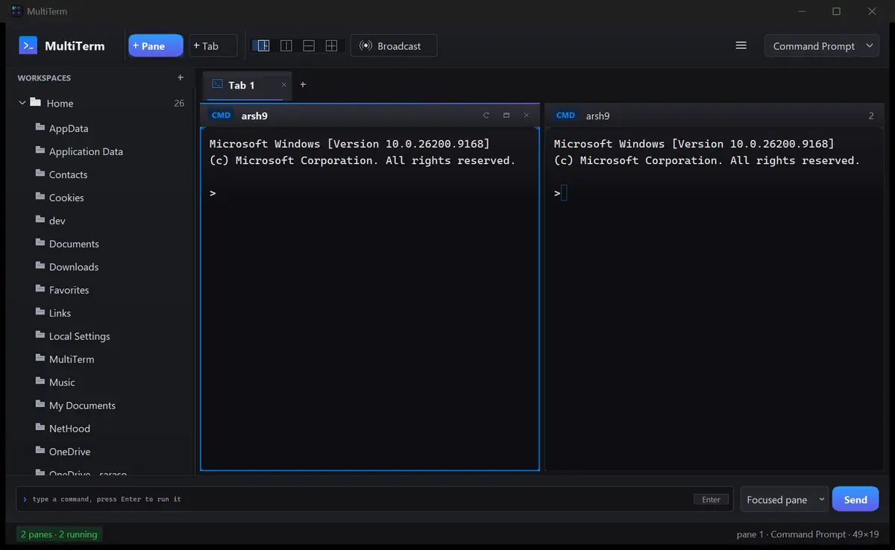
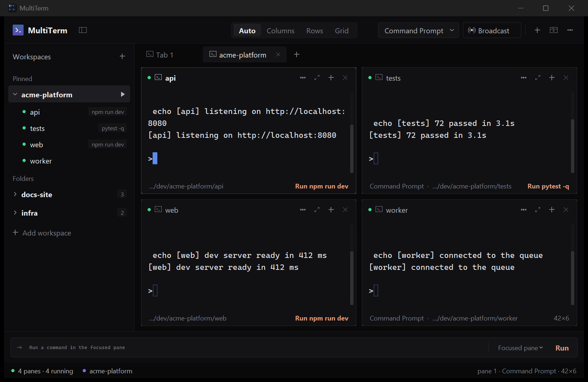

# MultiTerm

A multi-pane terminal workspace for Windows. Real shells over ConPTY, a
workspace model that remembers which folders a project needs and what each
one should run, and broadcast typing that sends one command to every pane.



Free and open source, MIT licensed. Windows 10 and 11.

## Why this exists

Windows Terminal splits panes fine. What it does not do is remember that
"this project" means four folders, that `api` runs one command and `web`
runs another, and start all of them when you sit down. I kept re-creating
the same layout every morning, so I built the thing that remembers it.

What is different from a split terminal:

- **Workspaces.** A workspace is a project folder. The folders inside it become
  panes. Opening the workspace opens all of them in one click, each shell
  already in its directory, in the layout you left it in.
- **Startup commands per folder.** Right-click a folder and set the command it
  should run on open. `npm run dev` in `web`, `pytest -w` in `tests`. Opening
  the workspace starts the project.
- **Broadcast typing.** Toggle it and every keystroke goes to every pane in
  the tab. Pull four repos or restart three services without repeating
  yourself.
- **Freeform panes.** The layout is a split tree, not a grid. Drag any divider,
  split right or down, maximise one pane, snap back to a preset.
- **Find in pane.** Ctrl+F highlights every match in the scrollback.

Everything else (tabs, themes, multiple shells, scrollback, selection) is
table stakes and is there too.



## Install

Download `MultiTerm.exe` from the [releases page](https://github.com/idk-arsh/multiterm/releases/latest) and run it. It is a single
executable; no installer, no admin rights, nothing written outside
`%APPDATA%\MultiTerm`.

To run from source you need Python 3.9 or newer:

```bat
pip install pywinpty
python main.py
```

`install.bat` does that and adds Desktop and Start Menu shortcuts.

## Using it

**Panes.** The `+` in the top bar adds a terminal to the current tab, up to
12. The layout switch next to the app name is Auto, Columns, Rows and Grid.
Drag a divider to resize; double-click one to centre it. `Ctrl+Shift+D` splits
the focused pane to the right, `Ctrl+Shift+S` splits it down, and the `+` on a
pane's own header splits it along its longer side. Once you drag or split, the
tab is in a custom layout and keeps your shape.

Every pane is a card. The header carries a status dot, the folder name, what
is running in it, and four controls: menu, maximise, split, close. The footer
shows the shell and folder and, when the folder has a startup command, a
**Run** action that fires it again.

**Workspaces.** The sidebar lists them. `+` adds a folder. Click a workspace
to expand it, click a folder inside to open a terminal there, press the arrow
on the workspace row to open every folder in a new tab. Right-click a folder
to set what it runs on open; the command shows as a chip next to the folder
and is saved with the workspace. Right-click a workspace to pin it to the top
of the sidebar. A green dot marks every folder that has a terminal open.

**Broadcast.** The Broadcast button in the top bar or `Ctrl+Shift+B`. The
button turns blue and the status line says so while it is on. It is scoped to
the current tab.

**Command bar.** The field at the bottom runs a one-off line against the
focused pane, all panes in the tab, or all panes everywhere. Pick the target
inside the field, then press Enter or Run. Up and down walk its history.

**Inside a pane.** Drag to select, double-click for a word, right-click copies
the selection or pastes if there is none. Wheel scrolls; a scrollbar appears
on the right and a "jump to latest" pill when you are scrolled back. `Ctrl+F`
opens find. Text size is `Ctrl+Shift+` plus or minus.

Shells are found automatically: Command Prompt, Windows PowerShell,
PowerShell 7, Git Bash, WSL and Python. The picker in the header sets which
one new panes use.

### Keyboard

| Keys | Action |
| --- | --- |
| `Ctrl+Shift+T` / `Ctrl+Shift+N` | New tab / new pane |
| `Ctrl+Shift+W` | Close focused pane |
| `Ctrl+Shift+D` / `Ctrl+Shift+S` | Split right / down |
| `Ctrl+Shift+M` | Maximise / restore pane |
| `Ctrl+Shift+E` | Show / hide sidebar |
| `Ctrl+Shift+B` | Broadcast typing |
| `Ctrl+F` | Find in pane |
| `Ctrl+Shift+C` / `Ctrl+Shift+V` | Copy / paste |
| `Ctrl+Tab`, `Alt+1` to `Alt+9` | Next pane, focus pane by number |
| `Shift+PgUp` / `Shift+PgDn` | Scroll history |
| `F11` | Full screen |

## How it works

There is no Electron and no web view. The whole thing is Python and Tk, with
the terminal emulator and all of the chrome drawn on canvases.

| File | What it does |
| --- | --- |
| `multiterm/vt.py` | VT100/xterm parser and screen buffer: SGR with 256 and true colour, scroll regions, insert/delete line, alternate screen, scrollback, OSC titles, DA/DSR responses |
| `multiterm/session.py` | One ConPTY child per pane via pywinpty, a reader thread, resize, restart, exit detection |
| `multiterm/widget.py` | Canvas renderer. Repaints only rows the emulator marked dirty. Key encoding, selection, smooth scrolling, overlay scrollbar, find |
| `multiterm/layout.py` | The split tree: leaves are panes, nodes are splits with a ratio. Dragging a divider changes a ratio |
| `multiterm/workspace.py` | Workspace model and persistence, including per-folder startup commands |
| `multiterm/chrome.py` | Sidebar, top bar, tabs, command bar, status line, pane headers and footers |
| `multiterm/gfx.py` | Rounded shapes, gradients, vector icons, text measurement, a small tween animator |
| `multiterm/ui.py` | Display scaling. One factor drives fonts and layout so nothing clips at 150% |
| `multiterm/log.py` | Rotating log, crash capture, diagnostics |
| `multiterm/app.py` | Window, tabs, pane grid, broadcast routing, the 60 fps loop |

Each frame gives the shells a few milliseconds to parse and spends the rest
drawing. Measured with four panes streaming thousands of lines each: about
70 frames a second, frame work averaging 12 ms. Background tabs keep draining
their shells without drawing.

Display scaling was the hardest bug. Tk enlarges point-sized fonts on a
high-DPI screen but knows nothing about pixel constants in the layout, so at
150% the text grew and the bars did not. `ui.py` pins Tk's font scaling to
the 96 dpi baseline and applies one factor to both fonts and layout.

## Building the exe

```bat
pip install pyinstaller
python tools\build_exe.py
```

Use the script rather than a bare `pyinstaller main.py`. PyInstaller does not
pick up pywinpty's `OpenConsole.exe`, and without it every shell in the
packaged app starts and is immediately torn down with
`STATUS_CONTROL_C_EXIT`. The script adds the four helper binaries.

## Tests

```bat
run_tests.bat
```

- `tests/test_vt.py`: 38 parser checks, including the exact ConPTY handshake.
- `tests/test_live.py`: spawns real shells and drives them concurrently.
- `tests/test_gui.py`: drives the real window. Typing, broadcast, layouts,
  divider dragging, find, workspaces, startup commands, plus checks that no
  text is clipped by its surface and no header label runs under a control.
  Run it with `MULTITERM_UI_SCALE=1.5` to simulate a 150% display.
- `tests/bench_render.py`: frame-time benchmark with four panes streaming.

## Logs

`%APPDATA%\MultiTerm\logs\multiterm.log`. Shell spawns and exits, uncaught
and Tk callback exceptions, and any frame over 45 ms with the per-pane
backlog at the time. Help > Copy diagnostics puts a summary on the clipboard.

## Known limits

- Windows only. It is built on ConPTY and there is no plan to abstract that.
- Wide (CJK) characters are treated as single cells ([#2](https://github.com/idk-arsh/multiterm/issues/2)).
- No mouse reporting to applications, so vim and similar are keyboard only ([#1](https://github.com/idk-arsh/multiterm/issues/1)).
- Resizing truncates or pads lines rather than reflowing them ([#4](https://github.com/idk-arsh/multiterm/issues/4)).
- Twelve panes per tab.

Those three are open as good first issues, with a plan in each, if you want
to take one.

## Contributing

Issues and pull requests are welcome. The tests above are the contract;
`tests/test_gui.py` runs against the real window and is the one to extend
when you change anything visible. Keep the tone of the code plain and the
comments about why, not what.

## License

MIT. See `LICENSE`.
